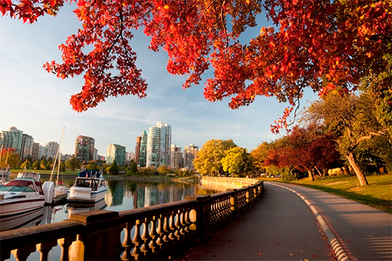
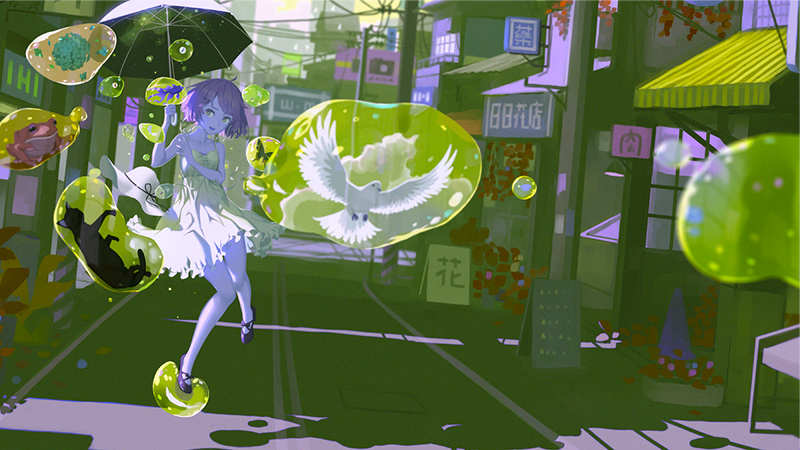

# FotoXop - C Image Processor

An educational image processing tool developed in **C** for the Data Structures I (ED1) course at UFES. This project implements pixel-level manipulation and custom filters without external libraries.

## 🛠 Features

The program allows opening `.ppm` images and applying various filters by directly manipulating the RGB values of each pixel matrix.

* **Core Filters:** Brightness adjustment (Lighten/Darken), Grayscale.
* **Edge Detection:** Implementation of the **Laplace Filter** and **Sobel Filter** for boundary identification.
* **Custom Algorithms:** Hand-coded spatial filters for image enhancement.

## 📊 Examples

| Original | Applied Filter | Result |
| :---: | :---: | :---: |
|  | Darken (60%) |  |
|  | Laplace |  |
|  | MyFilter |  |
*MyFilter: A filter I created that swaps the RGB channels of each pixel (Red → Green, Green → Blue, Blue → Red), producing a greenish effect.*

---

## 🧠 Key Takeaways

* **Memory Management:** Extensive use of dynamic allocation and pointers in C.
* **Matrix Manipulation:** Direct handling of 2D/3D arrays to represent image data.
* **Algorithm Logic:** Understanding the mathematical kernels behind spatial filtering.
